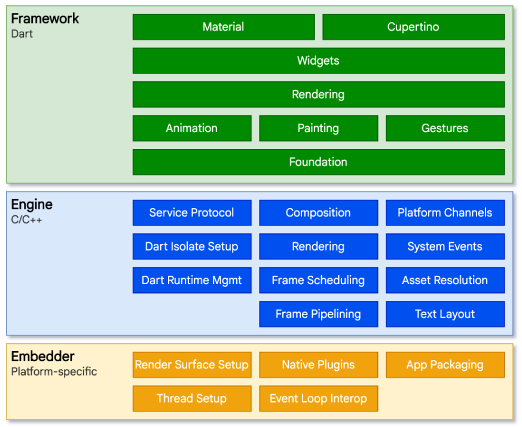

# Flutter 어플리케이션은 어떻게 동작하는가?

## 기존 네이티브 앱 개발 방식?

- Swift로 iOS를 혹은 Java로 안드로이드를 만드는 앱 개발을 할 때, 운영체제와 직접적으로 상호작용한다.
  즉, 버튼이나 text input등 모든 요소를 만들어달라고 운영체제에게 얘기함.
  그러면 운영체제가 안드로이드 상의 버튼 혹은 iOS 상의 버튼을 만들어줌

## 그러면 flutter 혹은 Dart 코드는 ??

- 운영체제와 직접적으로 상호작용하지는 않음. (flutter 에선 실제 iOS혹은 안드로이드 버튼을 만들어내는 기능은 존재하지 않음)
- 그 이유는 Flutter가 다른 크로스플랫폼 프레임워크처럼 동작하는게 아니라서 그렇다 (오히려 게임엔진인 유니티랑 비슷)
  
- 그림을 참고하면 우리가 Dart로 짠 코드는 Flutter 프레임워크 상에서 이용되며,
  Flutter 프레임워크는 애니메이션, Painting, Gestures 등 여러가지 요소를 포함하고 있음
  그런데, 이런것들을 실제 화면에 뿌려줄 때에는 iOS, 안드로이드, 맥OS, 윈도우와 같은 운영체제와 직접적으로 대화하지 않음 (Flutter 어플리케이션은 플랫폼의 Native Widget을 사용하지 않음음)
  대신에, 우린 엔진을 사용하게됨 (이 엔진은 C언어나 C++ 언어로 짜여져있음)
  이 엔진들이 우리 어플리케이션의 실제 UI를 렌더링하는데 책임져줄 Flutter 엔진임
  핸드폰이나 데스크톱의 운영체제들이 직접 그려주는것이 아닌 단순히 엔진을 작동시킬뿐임
  운영체제가 엔진을 돌리면 엔진이 프레임워크를 동작시키고 엔진이 UI를 그려주는 역할을 수행함
- 유저가 앱을 실행시키면 앱은 Flutter 라이브러리를 불러오고 우리가 만든 모든 UI를 랜더링 해줌
- Flutter를 사용할 때 문제점 : 네이티브 위젯을 사용하지 않는다.
- Embedder는 엔진을 가동시키는 runner 프로젝트를 가리킴, 그렇기에 iOS, 안드로이드, 맥OS, 윈도우, 리눅스를 위한 다양한 Embedder가 존재함

# Flutter와 React Native

- Native 앱 운영체제 상에서 가능한 위젯, 기본 컴포넌트들을 사용하고 싶으면 -> React Native ㅊㅊ (리액트 네이티브에선 버튼을 만들면 iOS와 안드로이드에서 서로 다르게보임)
  왜냐하면 React Native에선 자바스크립트를 통해서 운영체제와 대화를하고 운영체제는 네이티브 앱처럼 보이는 컴포넌트와 위젯을 만들어냄
- Flutter로 iOS 느낌나게 하려면 iOS를 배껴만든 컴포넌트들을 사용해야함 (비슷하게 꾸밀순 있어도 완전하게 똑같진않음)
- 커스텀에 자신이 있다면 flutter
